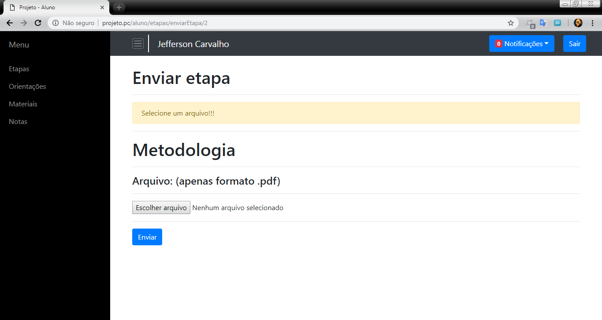

# Sistema gerenciador de TCC

Projeto desenvolvido no 6º semestre do curso de Ciência da Computação para a disciplina de Tópicos Integradores II.

Desenvolvido seguindo a estrutura MVC com linguagem PHP, HTML5, CSS3, biblioteca Jquery e o framework Bootstrap 4.

## Funcionamento:

O sistema é dividido em 4 partes principais: Coordenador, Orientadores, Alunos e Banca.

O coordenador é responsável por fazer o cadastro das diretrizes dos trabalhos, definição dos temas, do cronograma e das etapas de desenvolvimento do trabalho, cadastro dos professores orientadores, cadastro dos integrantes da banca avaliadora e acompanhamento do desenvolvimento das etapas de cada trabalho.

Os orientadores, depois de cadastrados pelo coordenador, são selecionados pelos alunos na etapa de cadastro de trabalhos. Eles acompanham todas as etapas de desenvolvimento dos trabalhos sob orientação deles e podem fazer comentários em cada etapa e visualizar os arquivos enviados pelos alunos. Também podem fazer o envio de materiais para os alunos e o cadastro das orientações realizadas durante o desenvolvimento.

Os alunos, depois de definir os grupos, fazem o cadastro dos trabalhos no sistema escolhendo um tema, um orientador, inserindo um título e os autores do trabalho. Depois de cadastrado o trabalho, os alunos visualizam as etapas do cronograma e podem realizar o envio de cada etapa. Depois de enviada uma etapa, é possível ler os comentários do orientador e atualizar o arquivo enviado posteriormente. Os alunos também visualizam os materiais enviados e as orientações cadastradas pelo orientador.

Os integrantes da banca avaliadora, depois de cadastrados pelo coordenador, podem visualizar todos os trabalhos e atribuir uma nota a cada um deles.

## Acesso ao login:

<figure>
	
	<figcaption>Figura 1 - Tela de acesso ao login</figcaption>
</figure>

# Login
 
Cada parte do sistema tem seu login, ao clicar no botão na tela de acesso ao login, o usuário é direcionado para a respectiva tela.

Todos os formulários de login são tradados para que se os campos não estiverem preenchidos exiba um alerta "Preencha os campos" ou se o usuário e/ou a senha não forem válidos, exibir o alerta "Usuário e/ou senha inválidos".

<figure>
	
	<figcaption>Figura 2 - Tela de Login</figcaption>
</figure>

# Coordenador

## -Diretrizes

Nesta tela, o coordenador define a quantidade máxima de autores do trabalho e os temas ou áreas do conhecimento que os alunos poderão escolher. 

Há uma tabela que puxa do banco de dados os temas cadastrados. Ao inserir um tema e clicar no botão "Adicionar", uma nova linha é inserida na tabela com o tema e um botão "Excluir". Ao clicar em excluir, a linha é removida da tabela. 

Se não for digitado um tema e clicar em "Adicionar", o sistema exibe o alerta: "Insira um Tema!!!".

Ao clicar em salvar, o sistema verifica se já tem algum tema cadastrado, se não houver e não foi adicionado nem um tema, é exibido o alerta: "Insira pelo menos um tema !!". 

Se já houverem temas cadastrados, verifica se foram adicionados novos temas e salva os dados no banco.

<figure>
	
	<figcaption>Figura 3 - Coordenador - Diretrizes</figcaption>
</figure>

## -Orientadores

Nesta tela o coordenador faz o cadastro dos orientadores inserindo o nome e o email.

A idéia aqui é enviar no email do orientador a senha de acesso, gerando um código pra cada um, mas como o ambiente de desenvolvimento é local, todos são cadastrados com a senha "teste".

Abaixo do formulário, há uma tabela com os orientadores já cadastrados e dois botões: "Ver orientações" e "Excluir".

Ao clicar em salvar, se um dos campos ou os dois não estiver preenchido, é exibido o alerta: "Preencha os campos". Se estiverem preenchidos, os dados são cadastrados no banco e uma nova linha é adicionada à tabela.

<figure>
	
	<figcaption>Figura 4 - Coordenador - Orientadores</figcaption>
</figure>

Ao clicar em excluir é exibida uma caixa de confirmação com: "Deseja realmente excluir este orientador ?". Caso o usuario confirme, é feita uma requisição ajax, o orientador é excluído do banco e a linha removida da tabela.

Ao clicar em "Ver orientações" é exibida uma tela com as orientações feitas pelo orientador.

Cada orientação é um card, no header é exibido o título do trabalho, no corpo são exibidos o título da orientação e a descrição das atividades realizadas e no footer a data da realização.

Caso não hajam orientações é exibido o alerta "Orientador X ainda não realizou nenhuma orientação".

<figure>
	
	<figcaption>Figura 5 - Coordenador - Orientações</figcaption>
</figure>

## -Cronograma

Nesta tela o coordenador faz o cadastro das etapas de desenvolvimento dos trabalhos, inserindo o evento e a data.

Há uma tabela que puxa do banco de dados as etapas já cadastradas e ao clicar em adicionar, se os campos "evento" e "data" estiverem preenchidos, é adiconada uma nova linha à tabela com os dados. 

Se os campos não estiverem preenchidos é exibido o alerta correspondente com "Insira uma data !!" ou "Insira um evento !!".

Ao clicar em salvar, as etapas adicionadas são salvas no banco e é exibido o alerta: "Cronograma salvo !!".

<figure>
	
	<figcaption>Figura 6 - Coordenador - Cronograma</figcaption>
</figure>

## -Trabalhos

Nesta tela são exibidos todos os trabalhos. Para cada trabalho é exibido o tema, o título, os autores, o orientador e os botões “Visualizar etapas”, “Avaliar” e “Avaliado”.

O nome do orientador é um link que direciona para a página orientações daquele orientador.

O botão “Avaliar” só aparece quando o trabalho é finalizado, ou seja, quando a última etapa tiver sido enviada e o botão “Avaliado” aparece se o trabalho já tiver sido avaliado.

Ao clicar em visualizar etapas, são exibidas todas as etapas do trabalho.

<figure>
	
	<figcaption>Figura 7 - Coordenador - Trabalhos</figcaption>
</figure>

Na tela de visualização das etapas, para cada etapa é exibido um card.

No cabeçalho do card, no lado esquerdo, a data prevista para envio da etapa, no lado direito, a data e a hora do envio da etapa. No corpo do card, o título da etapa e abaixo o botão “Visualizar”.

No footer do card, são exibidas a data e a hora da última atualização feita na etapa.

Caso a etapa ainda não tenha sido enviada, é exibido o card com a data prevista para envio da etapa no header e no corpo, o título da etapa e o alert “Ainda não enviado”.

Ao clicar em visualizar em uma etapa já enviada, é aberta uma nova guia com a visualização do documento.

<figure>
	
	<figcaption>Figura 8 - Coordenador - Etapas</figcaption>
</figure>

Na tela Trabalhos, caso o trabalho já tenho sido finalizado, é exibido o botão “Avaliar”. 

Ao clicar em avaliar, é exibido o formulário de avaliação com o título do trabalho e um campo, onde o coordenador insere uma nota entre 0 e 2,0 pontos.

Ao clicar em enviar, é verificado se foi inserida uma nota, caso contrário, é exibido o alert: “Insira uma nota”. 

Se a nota inserida estiver fora do range, o campo exibe um alerta.

Se a nota foi inserida e está dentro do range, os dados são salvos no banco e o coordenador é direcionado de volta para a página trabalhos.

<figure>
	
	<figcaption>Figura 9 - Coordenador - Avaliação</figcaption>
</figure>

## -Banca

Nesta tela o coordenador faz os cadastro dos integrantes da banca avaliadora, o funcionamento é o mesmo da página de cadastro de orientadores.

<figure>
	
	<figcaption>Figura 10 - Coordenador - Banca</figcaption>
</figure>

# Orientadores

## -Trabalhos e etapas

Nesta tela são exibidos os trabalhos sob orientação do orientador logado. Para cada trabalho é exibido o tema, o título, os autores e os botões “Visualizar etapas”, “Avaliar” e “Avaliado”.

O botão “Avaliar” só aparece quando o trabalho é finalizado, ou seja, quando a última etapa tiver sido enviada e o botão “Avaliado” aparece se o trabalho já tiver sido avaliado.

<figure>
	
	<figcaption>Figura 11 - Orientador - Trabalhos</figcaption>
</figure>

Ao clicar em visualizar etapas, são exibidas todas as etapas do trabalho.

Para cada etapa é exibido um card. No cabeçalho do card, no lado esquerdo, a data prevista para envio da etapa, no lado direito, a data e a hora do envio da etapa. No corpo do card, o título da etapa e abaixo os botões “Visualizar” e “Comentários”.

No footer do card, são exibidas a data e a hora da última atualização feita na etapa.

Caso a etapa ainda não tenha sido enviada, é exibido o card com a data prevista para envio da etapa no header e no corpo, o título da etapa e o alert “Ainda não enviado”.

Ao clicar em visualizar em uma etapa já enviada, é aberta uma nova guia com a visualização do documento.

Ao clicar em comentários, é exibido um card com os comentários da etapa e um campo para adicionar um novo comentário.

Ao clicar em enviar, é verificado se foi digitado um comentário, se não foi digitado nada, é exibido o alerta: "Escreva um comentário!!!".

Caso tenha sido digitado algo, é feita uma requisição ajax, os dados são adicionados ao banco e o comentário é adicionado ao card.

Cada comentário é um card, onde no header é exibido o nome do orientador, a data e a hora da postagem e, no corpo, o comentário em si.

<figure>
	
	<figcaption>Figura 12 - Orientador - Comentários</figcaption>
</figure>

Na tela Trabalhos, caso o trabalho já tenho sido finalizado, é exibido o botão “Avaliar”. 

Ao clicar em avaliar, é exibido o formulário de avaliação com o título do trabalho e um campo, onde o orientador insere uma nota entre 0 e 2,0 pontos.

Ao clicar em enviar, é verificado se foi inserida uma nota, caso contrário, é exibido o alert “Insira uma nota”. 

Se a nota inserida estiver fora do range, o campo exibe um alerta.

Se a nota foi inserida e está dentro do range, os dados são salvos no banco e o orientador é direcionado de volta para a página trabalhos.

<figure>
	
	<figcaption>Figura 13 - Orientador - Avaliação</figcaption>
</figure>

## -Orientações

Nesta tela são exibidas todas as orientações realizadas pelo orientador em todos os trabalhos sob orientação dele e um botão “Nova orientação”.

Cada orientação é um card, no header é exibido o título do trabalho, no corpo são exibidos o título da orientação e a descrição das atividades realizadas e no footer, a data da realização.

<figure>
	
	<figcaption>Figura 14 - Orientador - Orientações</figcaption>
</figure>

Ao clicar em “Nova orientação” é exibido o formulário de cadastro das orientações.

O orientador seleciona o trabalho, insere um título e uma descrição das atividades realizadas. 

Caso os campos título e descrição não sejam preenchidos, é exibido o alerta: “Preencha os campos título e descrição”.

Caso esteja tudo preenchido, os dados são salvos no banco e o orientador é redirecionado para a página orientações.

<figure>
	
	<figcaption>Figura 15 - Orientador - Nova Orientação</figcaption>
</figure>

## -Materiais

Nesta tela são exibidos todos os materiais enviados para todos os trabalhos sob orientação e o botão “Novo material”.

Cada material é um card, no header é exibido o título do trabalho para o qual o material foi enviado, no corpo são exibidos o título, a descrição, o link e/ou o arquivo e, no footer, são exibidas a data e hora do envio do material.

Se houver um arquivo, é exibido o botão “Ver arquivo” que ao clicar, abre uma nova guia com a visualização do documento.

<figure>
	
	<figcaption>Figura 16 - Orientador - Materiais</figcaption>
</figure>

Ao clicar em “Novo material”, é exibido o formulário de envio de materiais com o botão para selecionar os arquivos e o botão enviar.

O orientador seleciona o trabalho, insere um título e uma descrição e seleciona os arquivos clicando no botão “Escolher arquivo”.

Ao clicar em enviar, o formulário é enviado e, caso os campos título e descrição não sejam preenchidos, é exibido o alert: “Preencha os campos título e descrição”.

Se título e descrição estiverem preenchidos, o sistema verifica se foi enviado um arquivo ou link, se não foi enviado nenhum, exibe um alert: “Insira um link ou envie um arquivo”.

Se um arquivo foi enviado, mas não é do tipo PDF, exibe o alerta: “Somente arquivos PDF”.

Se for um arquivo PDF, os dados são salvos no banco, o arquivo é adicionado ao servidor e o orientador é redirecionado para a página materiais.

<figure>
	
	<figcaption>Figura 17 - Orientador - Enviar material</figcaption>
</figure>

## -Notificações

O orientador recebe notificações quando: 

 * O aluno enviar uma nova etapa;
 * O aluno atualizar uma etapa.

Sempre que a página é carregada ou atualizada, as notificações são puxadas do banco e exibidas através de uma requisição ajax.

Ao clicar em uma notificação, o aluno é direcionado para a página correspondente e outra requisição ajax é feita atualizando a notificação para lida no banco de dados.

<figure>
	
	<figcaption>Figura 18 - Orientador - Notificações</figcaption>
</figure>

# Alunos

## -Cadastrar Trabalhos

Ao fazer login, é verificado se o aluno já pertence a algum grupo, se já pertence, é redirecionado para etapas, se não, é redirecionado para a tela de cadastro de trabalho.

Na tela de cadastro de trabalho o aluno seleciona o tema, insere um título e seleciona o orientador. Abaixo ele seleciona os autores do trabalho que são inseridos em uma tabela com id e nome. O primeiro registro da tabela contém os dados do próprio aluno.

Para adicionar um autor, deve ser inserido o RA, e ao clicar em adicionar, o sistema faz uma requisição ajax ao banco de dados verificando se o aluno com aquele RA existe. Caso o aluno exista, é adicionada uma nova linha à tabela com id, nome e um botão excluir, caso não exista, ou foi adicionado o RA do próprio aluno logado ou o aluno adicionado já pertença a outro grupo, é exibido um alerta com o erro “Aluno não encontrado”. 

Se o aluno clicar em adicionar sem ter preenchido um RA, é exibido um alerta com “Digite o RA do aluno para adicionar”.

Se a quantidade máxima de autores já tiver sido adicionada, ao tentar adicionar um novo autor, é exibido o alerta “Quantidade máxima de autores atingida!!!”.

Ao clicar em “excluir” em um dos registros adicionados na tabela, a linha é removida e também os dados do formulário. 

Ao clicar em salvar, o formulário é enviado, caso o título não esteja preenchido, é exibido o alerta: “Insira um título”, se estiver tudo preenchido, salva os dados no banco.

<figure>
	
	<figcaption>Figura 19 - Aluno - Cadastrar Trabalho</figcaption>
</figure>

## -Etapas

A tela etapas puxa do banco de dados todas as etapas cadastradas pelo coordenador.

Se a etapa não foi enviada, aparece o botão enviar, se já foi enviada, aparecem os botões “Visualizar”, “Atualizar” e “Comentários”.

<figure>
	
	<figcaption>Figura 20 - Aluno - Etapas</figcaption>
</figure>

Ao clicar em enviar, é exibido o formulário de envio de etapa com o nome da respectiva etapa, o botão para selecionar os arquivos e o botão enviar.

Ao clicar em enviar, o formulário é enviado e o sistema verifica se foi selecionado um arquivo, se não foi, exibe o alert: “Selecione um arquivo”.

Se um arquivo foi enviado, mas não é do tipo PDF, exibe o alert: “Somente arquivos PDF”.

Se for um arquivo PDF, os dados são salvos no banco, o arquivo é adicionado ao servidor e o aluno é redirecionado para a página etapas.

<figure>
	
	<figcaption>Figura 21 - Aluno - Enviar Etapa</figcaption>
</figure>

Ao clicar em visualizar, em uma etapa já enviada, é aberta uma nova guia com a visualização do documento.

Ao clicar em atualizar é exibido o formulário de atualização, semelhante ao de envio, onde são feitas as mesmas verificações.

Ao enviar um arquivo válido, os dados são atualizados no banco, o arquivo antigo é excluído do servidor e é adicionado o novo arquivo.

Ao clicar em comentários, são exibidos os comentários feitos pelo orientador na respectiva etapa, mostrando o nome do orientador, a data e a hora do envio do comentário.

<figure>
	
	<figcaption>Figura 22 - Aluno - Comentários</figcaption>
</figure>

## -Orientações

Na tela de orientações, são exibidas as orientações recebidas, o título, a descrição do que foi feito e a data da realização.

<figure>
	
	<figcaption>Figura 23 - Aluno - Orientações</figcaption>
</figure>

## -Materiais

Na tela de materiais são exibidos todos os materiais enviados pelo orientador, é mostrado o título, a descrição, o link e/ou um botão “Ver arquivo” e abaixo a data e a hora em que foi postado aquele material. 

Se houver um arquivo, ao clicar no botão, é aberta uma nova guia com a visualização do documento.

<figure>
	
	<figcaption>Figura 24 - Aluno - Materiais</figcaption>
</figure>

## -Notas

Na tela notas, são exibidos quatro cards com as notas do coordenador, do orientador, dos avaliadores da banca e o total da soma de todas as notas.

Caso ainda não tenha sido avaliado, é exibido o alert: “Ainda não avaliado” no respectivo card.

<figure>
	
	<figcaption>Figura 25 - Aluno - Notas(1)</figcaption>
</figure>

<figure>
	
	<figcaption>Figura 26 - Aluno - Notas(2)</figcaption>
</figure>

## -Notificações 

O aluno recebe notificações quando: 

* O orientador enviar um novo material;
* O orientador fazer um comentário em uma das etapas enviadas;
* O orientador cadastrar uma nova orientação;
* For avaliado pelo orientador, coordenador ou banca.

Sempre que a página é carregada ou atualizada, as notificações são puxadas do banco e exibidas através de uma requisição ajax.

Ao clicar em uma notificação, o aluno é direcionado para a página correspondente e outra requisição ajax é feita atualizando a notificação para lida no banco de dados.

<figure>
	
	<figcaption>Figura 27 - Aluno - Notificações</figcaption>
</figure>

# Banca Avaliadora

## -Trabalhos

Nesta tela são exibidos todos os trabalhos a serem avaliados. 

Cada trabalho é exibido em um card, no header é exibido o tema do trabalho, no corpo são exibidos o título do trabalho, os autores, o orientador e os botões “Visualizar”, “Avaliar”, “Avaliado” e “Ainda não finalizado”.

Se um trabalho ainda não foi finalizado, ou seja, se a última etapa ainda não foi enviada, é mostrado o botão “Ainda não finalizado” que não tem ação nenhuma.

Se o trabalho foi finalizado, são exibidos os botões “Visualizar” e “Avaliar”.

Se o trabalho já foi avaliado são exibidos os botões “Visualizar” e o botão “Avaliado”, que não tem nenhuma ação.

Ao clicar em visualizar, é aberta uma nova guia com a visualização do documento correspondente  à etapa final.

<figure>
	
	<figcaption>Figura 28 - Banca - Trabalhos(1)</figcaption>
</figure>

<figure>
	
	<figcaption>Figura 29 - Banca - Trabalhos(2)</figcaption>
</figure>

Ao clicar em avaliar, é exibido o formulário de avaliação com o título do trabalho e um campo, onde o avaliador insere uma nota entre 0 e a nota máxima.

A banca avaliadora pode dar no máximo 6 pontos para um trabalho, então a nota máxima que cada avaliador pode dar é calculada pelo sistema dividindo 6 pela quantidade de avaliadores cadastrados.

Ao clicar em enviar, é verificado se foi inserida uma nota, caso contrário, é exibido o alert: “Insira uma nota”. 

Se a nota inserida estiver fora do range, o campo exibe um alerta.

Se a nota foi inserida e está dentro do range, os dados são salvos no banco.

<figure>
	
	<figcaption>Figura 30 - Banca - Avaliar</figcaption>
</figure>

